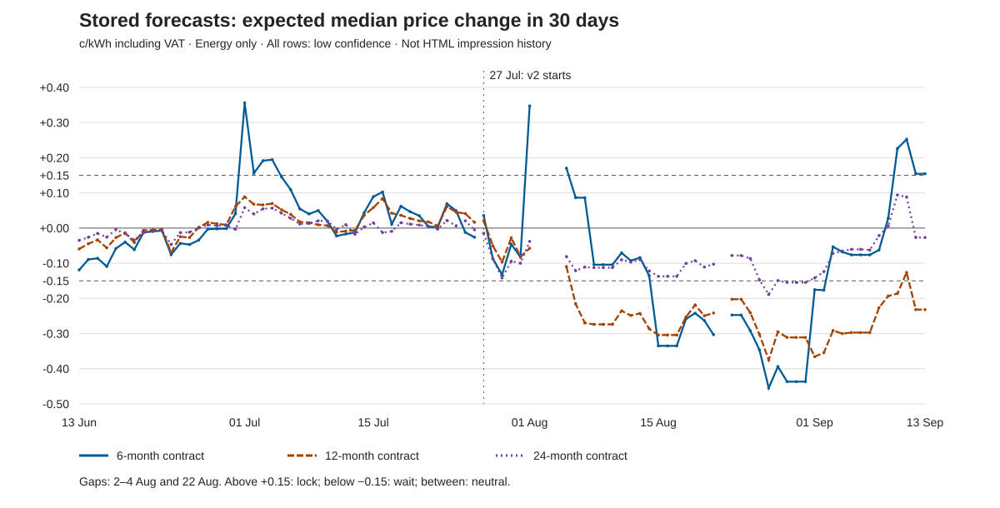

# Three-month forecast stability review

## Main finding

The stored 6-month-contract outlook changes enough to need clearer uncertainty language. But the evidence does **not** show repeated direct switches from strong wait advice to strong lock advice on consecutive stored observations. The signals pass through neutral. Some large changes come from the monthly delivery-window roll, not noise in one fixed futures instrument. Other changes are real same-delivery futures price moves. These effects must be tested separately.

On 13 September, the 6m expected change is **+0.1545 c/kWh**, only **0.0045** above the lock cutoff. The 12m value is **−0.2318** (wait), and 24m is **−0.0267** (neutral). This is not a broad market consensus. Every exported forecast has **low confidence**. Current code derives confidence from history count, not a calibrated forecast-error probability.

The v2 normal-premium input does not update in this sample. Its historical evidence ends on 26 July at 109 observations. Validate that learning path and comparable evaluation before trying to make the signal smoother.

## Evidence and scope

- Dates: **13 June–13 September 2026**, inclusive; 93 calendar days, 89 stored forecast dates.
- The complete source is `export-20260913T073334Z` only. Failed export attempts are not inputs.
- Verified: manifest SHA-256, complete status, all six data-file hashes, byte counts, and row counts. There are 810 forecast rows, 1,499 FI Base futures rows, 315 retail statistic rows, and 80 schema rows. The database clock was 13 September 2026, 07:33:36 UTC; the complete export ended at 07:33:42 UTC.
- Nine forecast rows per date, except 27 July with 18: both model versions exist. Missing dates: **2, 3, 4 and 22 August**. We do not fill gaps or infer failed run causes.
- Headline selection: median, 30-day horizon; v1 through 26 July and v2 from 27 July. This gives 267 rows, 89 per term. All other original rows remain available.
- This is **stored forecast history, not proven HTML impression history**. Stored rows do not prove which value a visitor saw, when caches refreshed, or what historical page eligibility rules allowed.
- Prices and forecast changes below are **c/kWh including VAT**, energy only. Futures prices are **EUR/MWh excluding VAT**. Monthly fees are excluded. A 6m, 12m or 24m label means **contract term**, not forecast horizon. Every forecast is a 30-day outlook. This is not a whole-customer optimum recommendation.

## Timeline



The chart uses actual dates and stops lines at missing days and the 27 July model boundary. It does not connect over absent data. Zero and ±0.15 thresholds are shown. Exact daily current and forecast prices are in `daily-headline.csv`.

### Weekly view

Each row uses the **last available stored date inside the ISO week**, not an average and not a carried-forward Sunday value. The first week is partial. In the week ending 2 August, the correct date is **1 August**.

| ISO week | Last stored date | 6m change / signal | 12m change / signal | 24m change / signal |
| --- | --- | --- | --- | --- |
| 2026-W24 | 2026-06-14 | -0.0892 / neutral | -0.0445 / neutral | -0.0261 / neutral |
| 2026-W25 | 2026-06-21 | -0.0093 / neutral | -0.0048 / neutral | -0.0095 / neutral |
| 2026-W26 | 2026-06-28 | -0.0022 / neutral | +0.0122 / neutral | +0.0067 / neutral |
| 2026-W27 | 2026-07-05 | +0.1460 / neutral | +0.0523 / neutral | +0.0426 / neutral |
| 2026-W28 | 2026-07-12 | -0.0168 / neutral | -0.0086 / neutral | +0.0097 / neutral |
| 2026-W29 | 2026-07-19 | +0.0466 / neutral | +0.0274 / neutral | +0.0114 / neutral |
| 2026-W30 | 2026-07-26 | -0.0261 / neutral | +0.0164 / neutral | -0.0048 / neutral |
| 2026-W31 | 2026-08-01 | +0.3474 / lock | -0.0574 / neutral | -0.0379 / neutral |
| 2026-W32 | 2026-08-09 | -0.1042 / neutral | -0.2738 / wait | -0.1124 / neutral |
| 2026-W33 | 2026-08-16 | -0.3349 / wait | -0.3041 / wait | -0.1372 / neutral |
| 2026-W34 | 2026-08-23 | -0.2472 / wait | -0.2023 / wait | -0.0780 / neutral |
| 2026-W35 | 2026-08-30 | -0.4367 / wait | -0.3110 / wait | -0.1546 / wait |
| 2026-W36 | 2026-09-06 | -0.0761 / neutral | -0.2971 / wait | -0.0604 / neutral |
| 2026-W37 | 2026-09-13 | +0.1545 / lock | -0.2318 / wait | -0.0267 / neutral |

### Signal stability

| Term | Neutral | Wait | Lock | Signal changes | Raw sign reversals |
| --- | --- | --- | --- | --- | --- |
| 6 | 61 | 18 | 10 | 7 | 9 |
| 12 | 52 | 37 | 0 | 3 | 4 |
| 24 | 85 | 4 | 0 | 4 | 14 |

- **6m:** 2026-07-01: neutral → lock; 2026-07-05: lock → neutral; 2026-08-01: neutral → lock; 2026-08-06: lock → neutral; 2026-08-15: neutral → wait; 2026-09-03: wait → neutral; 2026-09-10: neutral → lock.
- **12m:** 2026-08-06: neutral → wait; 2026-09-11: wait → neutral; 2026-09-12: neutral → wait.
- **24m:** 2026-08-27: neutral → wait; 2026-08-28: wait → neutral; 2026-08-29: neutral → wait; 2026-09-01: wait → neutral.

A signal change compares adjacent **available observations** (88 pairs per term), including gap-spanning pairs and the model boundary. It is not necessarily a next-calendar-day comparison. `daily-revisions.csv` gives the day gap and model-boundary flag for each pair. A raw sign reversal means the product of two signed expected changes is negative; zero does not count. This measure can count tiny neutral moves. It is not the same as advice switching. No adjacent pair switches directly between wait and lock in either direction.

Lock means expected change ≥ +0.15; wait means ≤ −0.15; otherwise neutral. Equality belongs to the strong category. Stored rounded values are used for this review; service labels use the unrounded calculation. At the current 0.15 threshold, the rounded 6m classification matches every stored signal. As a simple sensitivity check, 6m switch counts are **7 at 0.15, 8 at 0.20, and 12 at 0.25** across the same 89 observations. A higher cutoff alone does not guarantee more stable labels; this is not a backtest of decision quality.

### Preserve the 27 July boundary

| Model | Term | Current | Forecast | Expected change | Signal |
| --- | --- | --- | --- | --- | --- |
| fixed_term_ewma_gap_v1 | 6 | 11.8646 | 11.8482 | -0.0164 | neutral |
| fixed_term_ewma_gap_v1 | 12 | 10.4800 | 10.4957 | 0.0157 | neutral |
| fixed_term_ewma_gap_v1 | 24 | 9.6400 | 9.6289 | -0.0111 | neutral |
| fixed_term_ewma_gap_v2 | 6 | 11.6488 | 11.6845 | 0.0357 | neutral |
| fixed_term_ewma_gap_v2 | 12 | 10.4800 | 10.5009 | 0.0209 | neutral |
| fixed_term_ewma_gap_v2 | 24 | 9.6400 | 9.6252 | -0.0148 | neutral |

The two models are separate records, not duplicate observations to average. V2 records canonical current retail inputs and observed-seller historical inputs separately. A continuous headline selection is useful for review, but it does not make the two bases or model versions equivalent. Full source metadata remains in the CSV and JSON export.

The 6m median contract count falls from **20 on 13 June to 10 on 13 September** (9 on 10 September). It changes from **9 on 31 July to 14 on 1 August**. Median input movements can combine seller repricing and changes in the eligible product mix. This aggregate export cannot separate these causes. It does not show that each same contract rose. This also limits current-to-forecast level comparisons across the 27 July basis change.

## What moves the forecast?

Let R be current median retail price, H futures-implied hedge cost, and N the normal retail premium. The stored coefficients are EWMA alpha **0.25**, gap closure lambda **0.30**, and direction threshold **0.15 c/kWh**.

`expected change = 0.3 × (H + N − R)`

`revision in expected change = 0.3 ΔH + 0.3 ΔN − 0.3 ΔR`

Here, “revision” means a change between successive **30-day-outlook vintages**. The target date advances with each forecast date; this is not a revision for one fixed target date, nor a realized customer price change. The output CSV retains the small residual from four-decimal stored rounding. Throughout v2 the median N values remain **1.3692 / 1.7866 / 2.1343** for 6/12/24m. V2 metadata always ends its observed history on **26 July**, with **109 observations**. Thus v2 daily revisions come from H and R, not renewed premium learning. The old observed-history selection and new canonical current basis explain the data-path concern; this review does not change either basis.

### Reconstructed hedge costs and calendar rolls

The local reconstruction follows `FixedTermHedgeCostService.php`: next full calendar month; calendar-day weights; one latest trade date strictly before the forecast date; month → quarter → year fallback; conversion factor **0.1255**. All **270 stored median hedge costs**, including both 27 July models, reconstruct within **0.0000498066 c/kWh** (asserted limit 0.000051).

At a month boundary, calculate both the old and new delivery windows on the **same new trade-date curve**. Their difference is the delivery-roll effect, including fallback choices for those windows. Separately, recalculate the old window across the old and new curves. That remainder can include **instrument selection changes as well as instrument price changes**. It is not pure same-instrument movement. This is an accounting decomposition, not proof of economic cause.

| Date | Term | Revision | 0.3 ΔH | 0.3 ΔN | −0.3 ΔR | Roll effect on forecast | Old-window curve / selection |
| --- | --- | --- | --- | --- | --- | --- | --- |
| 2026-07-01 | 6 | +0.3150 | +0.3542 | -0.1187 | +0.0795 | +0.3294 | +0.0248 |
| 2026-08-01 | 6 | +0.4298 | +0.4605 | +0.0000 | -0.0306 | +0.3940 | +0.0664 |
| 2026-09-01 | 6 | +0.2614 | +0.2524 | +0.0000 | +0.0090 | +0.1093 | +0.1432 |
| 2026-07-01 | 12 | +0.0275 | +0.0529 | -0.0296 | +0.0041 | +0.0085 | +0.0444 |
| 2026-08-01 | 12 | +0.0239 | +0.0427 | +0.0000 | -0.0189 | -0.0216 | +0.0643 |
| 2026-09-01 | 12 | -0.0546 | -0.0546 | +0.0000 | -0.0000 | -0.1455 | +0.0909 |
| 2026-07-01 | 24 | +0.0615 | +0.0665 | -0.0194 | +0.0144 | +0.0220 | +0.0445 |
| 2026-08-01 | 24 | +0.0621 | +0.0590 | +0.0000 | +0.0032 | +0.0176 | +0.0413 |
| 2026-09-01 | 24 | +0.0129 | +0.0091 | +0.0000 | +0.0037 | -0.0455 | +0.0547 |

All contributions in this table are c/kWh. Four-decimal rounding can prevent displayed columns from summing exactly. `month-boundary-decomposition.csv` retains more precision, trade dates, old/new start months and same-curve costs for all three terms.

The 6m hedge-cost roll is **+1.0980 on 1 July, +1.3134 on 1 August, and +0.3643 on 1 September**. The corresponding forecast effects are **+0.3294 / +0.3940 / +0.1093**. The largest adjacent 6m revision is 31 July → 1 August: **+0.4298**, with hedge contribution **+0.4605**, retail contribution **−0.0306**, and premium contribution **zero**. The same-curve roll contributes about **92% under this new-curve decomposition** (31 July settlements; the 31 July forecast used 30 July settlements). This is not a unique causal share: holding the old 30 July curve fixed gives a roll forecast contribution of **+0.3655**, about **85%**. The order of decomposition changes the attribution. The roll replaces an earlier delivery month with a later one, increasing winter exposure; it is not noise in one unchanged instrument. For example, the July-to-August forecast boundary shifts delivery from August–January to September–February.

### Fixed-delivery futures: real down and up moves

| Fixed delivery | 12 Jun | 11 Sep | Change | Adjacent pairs / mean abs / max abs | 7-day pairs / mean abs / max abs |
| --- | --- | --- | --- | --- | --- |
| Q4 2026 | 72.35 | 102.37 | +41.49% | 65 / 1.73% / 4.75% | 61 / 5.48% / 14.69% |
| Q1 2027 | 82.63 | 115.72 | +40.05% | 65 / 1.42% / 5.38% | 61 / 4.66% / 13.26% |
| Calendar 2027 | 47.33 | 62.75 | +32.58% | 65 / 1.20% / 3.74% | 61 / 3.36% / 11.45% |

The start is **12 June**, the last session before the review begins; the end is **11 September**, the last exported session. Returns are `100 × (new settlement / old settlement − 1)`. Adjacent-session metrics compare successive available observations **of the same instrument**. Seven-day metrics require a row exactly seven calendar days earlier for that same instrument inside this comparison sample. No carry forward, interpolation, cross-instrument substitution, or seven-session approximation is used. Mean/max absolute percentages describe return size, not signed direction. Each instrument has 66 observations; there are **5 unmatched seven-day endpoints per instrument**, also listed in `analysis-summary.json` (including early endpoints without an in-sample predecessor).

Q4 2026 specifically falls from **92.74 on 31 July to 83.27 on 28 August**, then rises to **102.37 on 11 September**. Thus some down/up movement is real for fixed delivery, not just a rolling basket. This export contains settlement values; **1,475 of 1,499 raw volume fields are null; 24 are present**. Sparse volume evidence does not establish market-wide liquidity, trading activity, market depth, or a news cause. No news explanation is claimed.

## Accuracy: not enough evidence for v2

| Term | Evaluations | Forecast MAE | Unchanged-price MAE |
| --- | --- | --- | --- |
| 6 | 15 | 1.0353333 | 0.9824133 |
| 12 | 15 | 0.3946267 | 0.3778400 |
| 24 | 15 | 0.4174733 | 0.4010133 |

MAE is mean absolute forecast price error in c/kWh. The unchanged-price baseline predicts that the target-date retail price equals the forecast-date current price, using the **same evaluated rows and stored evaluation facts**, not a new join to current statistic rows. Current statistics differ from stored actuals on 3/2/1 evaluated rows for 6/12/24m; later table contents must not replace the frozen evaluation evidence. All 15 median evaluations per term are v1, from **13–27 June**, for target dates **13–27 July**. All three forecast MAEs are worse than the unchanged-price baseline in this small sample. Daily 30-day forecasts overlap, so these are not 15 independent trials.

No v2 median row has an evaluation. Matured but unevaluated exported rows as of **13 September**, with target date ≤ that date:

| Model | Term | Median rows | All quantiles |
| --- | --- | --- | --- |
| fixed_term_ewma_gap_v1 | 6 | 30 | 90 |
| fixed_term_ewma_gap_v2 | 6 | 16 | 48 |
| fixed_term_ewma_gap_v1 | 12 | 30 | 90 |
| fixed_term_ewma_gap_v2 | 12 | 16 | 48 |
| fixed_term_ewma_gap_v1 | 24 | 30 | 90 |
| fixed_term_ewma_gap_v2 | 24 | 16 | 48 |

These counts include only this exported forecast window, not the entire forecast table. The evaluator requires **observed_seller_data** on the exact target date. The exported statistics now use **canonical_calculation**. Do not fill absent evaluations with canonical values and call them comparable actuals. V2 starts from canonical retail while the current evaluator seeks observed targets; same-basis validation is required.

`direction_correct` is **thresholded direction-category accuracy**, not raw numerical sign accuracy. `directionCategory()` keeps rising and falling, but maps both slightly_rising and slightly_falling (and flat) to flat. No direction-accuracy percentage is reported here. This tiny, old-model, overlapping sample is insufficient to establish v2 accuracy or useful consumer timing advice.

## Proposals — no application changes made

1. **Repair and validate premium learning and same-basis evaluation first.** Establish which historical basis belongs to the model, and test correct continuation after 26 July. Preserve old forecast evidence. Do not silently relabel canonical values as observed actuals.
2. **Backtest comparable start and delivery windows.** Separate delivery rolls, source selection, fixed-instrument movement and retail changes. Measure forecast error and unchanged-price baselines on enough out-of-sample dates and market conditions.
3. **Use softer, uncertainty-aware copy.** Say “6-month contract: 30-day price outlook.” Explain that p20/p80 are market price quantiles, **not confidence bounds**. Avoid strong low-confidence lock advice near a threshold. Do not imply that an energy-price direction alone selects the best customer contract.
4. **Then test persistence or hysteresis**, with explicit trade-offs against responsiveness. Compare reduced signal changes with delayed useful warnings and forecast error. Do not hide real market movement merely to produce a smooth line.

## Reproduce and audit

Run from the repository root:

```sh
python3 tasks/forecast-stability-review/analyze.py
git diff --check
```

Python standard library only. No production access, Laravel boot, database access, dependency install, or app change is needed. The script reads only the complete local export and writes artifacts in this task directory. It verifies hashes/counts before generation and asserts key findings and hedge reconstruction. Outputs are deterministic; there is no run timestamp.

Artifacts:
- `all-original-forecasts.csv`: every original forecast field and all 810 rows; metadata stays a JSON string. CSV blanks represent JSON nulls; use original JSON for authoritative types.
- `daily-headline.csv`: full selected median current/forecast rows, 267 rows.
- `july27-dual-models.csv`: six median rows that preserve both model versions.
- `weekly-headline.csv`: signed weekly changes and signals, with actual chosen dates.
- `daily-revisions.csv`: all 264 adjacent-observation decompositions and gap flags.
- `month-boundary-decomposition.csv`: nine same-curve delivery-roll decompositions.
- `fixed-maturity-futures.csv`: original fields for the three fixed-delivery instruments plus adjacent and exact-seven-day returns.
- `analysis-summary.json`: verified provenance, counts, transitions, metrics, reconstruction error and evaluation coverage.
- `forecast-timeline.svg`: standalone chart with a text alternative and distinct line patterns.

### Source code references

These are local repository code references used to interpret the stored evidence, not proof of the exact deployed code on every past date:
- `laravel/app/Services/PriceForecasting/FixedTermHedgeCostService.php`: `calculate`, `latestTradeDateBefore`, `maturityForMonth`, `loadCurve`.
- `laravel/app/Services/PriceForecasting/FixedTermPriceForecastService.php`: forecast gap calculation, `historyPremiumEvidence`, `directionLabel`, `directionCategory`, `consumerSignal`, `confidenceLabel`.
- `laravel/app/Services/PriceForecasting/FixedTermForecastEvaluationService.php`: `evaluateMatured`, observed-target selection and category comparison.
- `laravel/app/Livewire/FixedContractPriceForecast.php` and `laravel/resources/views/livewire/fixed-contract-price-forecast.blade.php`: current page selection and display; the historical retail chart is not stored forecast-run history.
- `laravel/config/price_forecasting.php`: default model settings; stored metadata supplies the coefficients used in this analysis.

No recommendation above is implemented by this review. No production mutation was made.
